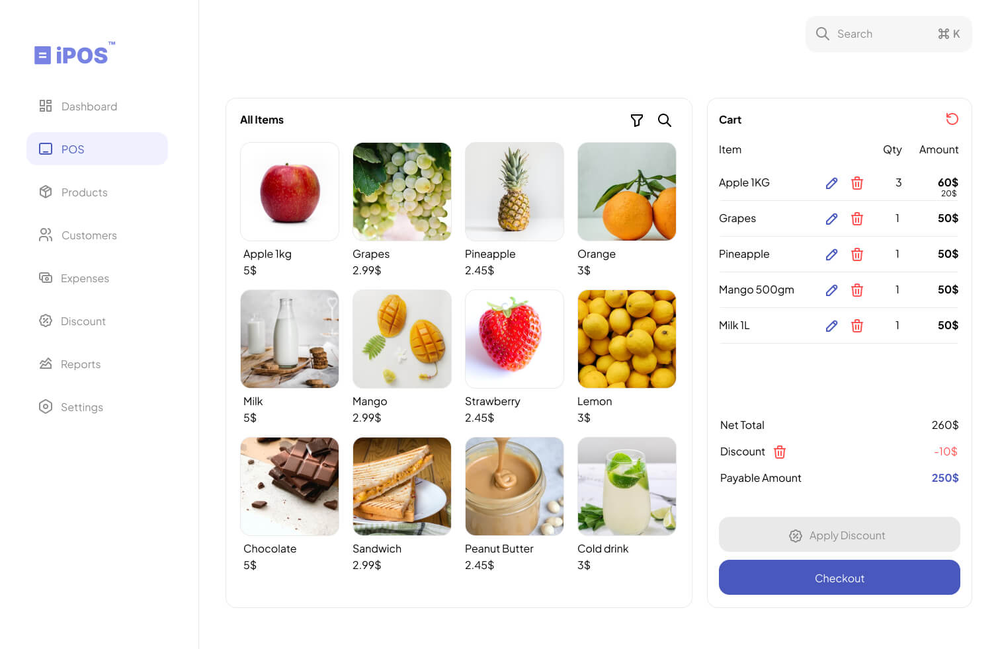
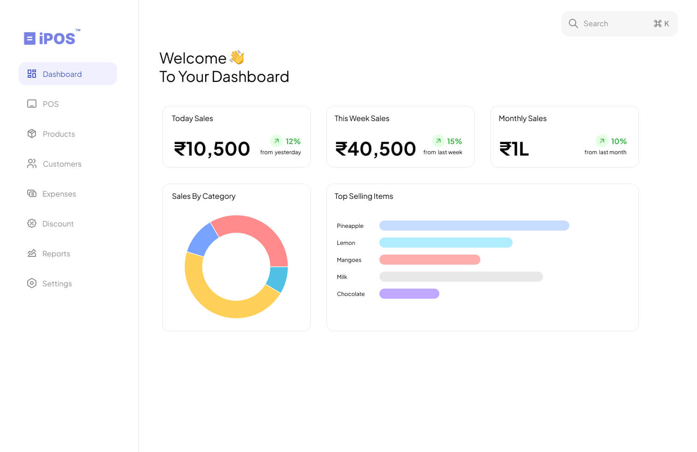

<div align="center" markdown="1">

# Island POS (iPOS) - Offline Point of Sale App


---

[](https://github.com/dhruvilxcode/island-pos/releases)


Free Desktop Point-of-Sale (POS) software for Restaurants, Cafes, Grocery Stores, Bakeries, and Retail outlets.

[Download Now](https://github.com/dhruvilxcode/island-pos/releases)





</div>


### Features
- [x] Works Completely Offline
- [x] Manage Products
- [x] Create Receipts
- [x] Track Sales & Generate Reports
- [x] Categories, Taxes, Customers
- [x] Open Source

## Development

iPOS is built on React.js and Electron. It is offline by default and uses
a local SQLite file as the database.

### Pre-requisites

To get the dev environment up and running you need to first set up Node.js version
16.14.0 and npm. For this, we suggest using
[nvm](https://github.com/nvm-sh/nvm#installing-and-updating).

### Clone and Run

Once you are through the Pre-requisites, you can run the following commands to
setup iPOS for development and building:

```bash
# clone the repository
git clone https://github.com/dhruvilxcode/island-pos

# change directory
cd island-pos

# install dependencies
npm install

# build
npm run build
npm run build:win
npm run build:mac
```

#### Development

To run iPOS in development mode (with hot reload, etc):

```bash
# start the electron app
npm run dev
```

## License

[GNU Affero General Public License v3.0](LICENSE)
